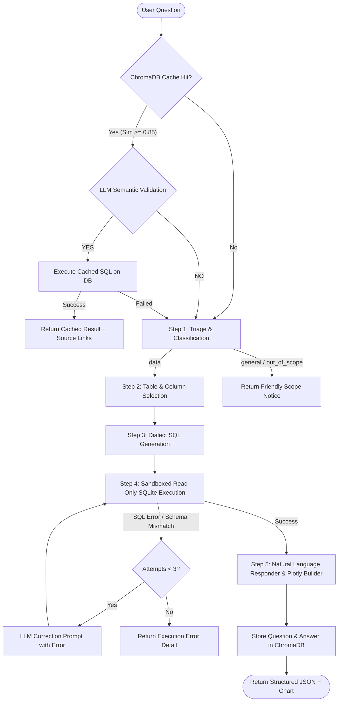

# NL-to-SQL Assistant

A production-grade, enterprise-ready Natural Language to SQL (NL-to-SQL) system featuring an intelligent 5-stage RAG pipeline, dual-tiered semantic caching with ChromaDB, automated golden query generation, and chunked batch document ingestion with exact page-level PDF deep linking.

Built with a high-performance **FastAPI** backend and a refined, utilitarian **React 19 + Vite + TypeScript** frontend with dark/light themes and dynamic Plotly data visualizations.

---

## Table of Contents

- [Overview](#overview)
- [Key Features](#key-features)
- [Tech Stack](#tech-stack)
- [Architecture & System Design](#architecture--system-design)
  - [High-Level Architecture](#high-level-architecture)
  - [5-Stage Query Processing Pipeline](#5-stage-query-processing-pipeline)
  - [Dual-Tier Semantic Caching & LLM Validation](#dual-tier-semantic-caching--llm-validation)
  - [Chunked Doc-QA Batch Ingestion & PDF Deep-Linking](#chunked-doc-qa-batch-ingestion--pdf-deep-linking)
  - [Rate Limiting & Anti-Starvation Scheduling](#rate-limiting--anti-starvation-scheduling)
- [Prerequisites](#prerequisites)
- [Getting Started](#getting-started)
  - [1. Clone Repository](#1-clone-repository)
  - [2. Backend Setup](#2-backend-setup)
  - [3. Frontend Setup](#3-frontend-setup)
  - [4. Environment Configuration](#4-environment-configuration)
  - [5. Running the Application](#5-running-the-application)
- [Environment Variables](#environment-variables)
- [API Reference](#api-reference)
  - [Datasets Endpoints](#datasets-endpoints)
  - [Query Pipeline Endpoints](#query-pipeline-endpoints)
  - [Dashboard & Cache Endpoints](#dashboard--cache-endpoints)
  - [Doc-QA Batch Ingestion Endpoints](#doc-qa-batch-ingestion-endpoints)
  - [Health Check & Static Assets](#health-check--static-assets)
- [Directory Structure](#directory-structure)
- [CLI Scripts & Utilities](#cli-scripts--utilities)
- [Frontend Design System & Components](#frontend-design-system--components)
- [Deployment](#deployment)
  - [Production Docker Setup](#production-docker-setup)
  - [Manual / VPS Deployment](#manual--vps-deployment)
- [Troubleshooting & FAQ](#troubleshooting--faq)
- [Development Log & Mistakes Reference](#development-log--mistakes-reference)

---

## Overview

The **NL-to-SQL Assistant** allows non-technical business stakeholders and technical data analysts alike to query structured tabular data (CSV and multi-sheet Excel files) in plain English. The system converts questions into deterministic, dialect-compliant SQLite queries, executes them in a safe read-only sandbox, validates results against strict business intelligence (BI) formulas, and renders rich natural language summaries along with dynamic interactive charts.

---

## Key Features

- **Multi-Format Dataset Ingestion**: Instant drag-and-drop ingestion of `.csv` and multi-sheet `.xlsx` / `.xls` files into isolated, in-memory SQLite tables with automatic ISO 8601 date normalization.
- **5-Stage Self-Healing Pipeline**:
  1. *Triage & Classification* — Fast intent routing (`data`, `general`, `out_of_scope`).
  2. *Adaptive Table & Column Selection* — Single-pass or two-pass pruning for complex schemas.
  3. *Dialect-Grounded SQL Generation* — Injects SQLite dialect rules, case-insensitive wrappers (`LOWER()`), and KPI formulas.
  4. *Sandboxed Execution & Retry Loop* — Automated self-healing loop (up to 3 retries) for syntax and schema errors, plus ratio BI sanity checks.
  5. *Structured BI Response & Visualization* — Generates deterministic JSON responses with query categorization, confidence badges, evidence metrics, and Plotly charts.
- **Dual-Tier Semantic Caching (ChromaDB + Gemini Embeddings)**:
  - Embeds queries via Google Gemini `gemini-embedding-001`.
  - Performs cosine similarity lookups in ChromaDB (`threshold = 0.85`).
  - Employs secondary LLM semantic equivalence checks to eliminate false positives.
  - Automatically indexes auto-generated "Golden Queries" upon dataset upload.
- **Doc-QA Batch Ingestion & Exact Page-Numbered PDF Reports**:
  - Ingests structured `.docx` question banks with role and section hierarchy.
  - Runs batch queries across a chunked, re-entrant state machine.
  - Compiles professional executive PDFs via `fpdf2` using atomic file swaps.
  - Stores exact page references (`pdf.page_no()`) in ChromaDB.
  - Chat interface renders **"Source"** buttons that deep-link directly to the corresponding PDF page.
- **Priority-Aware Rate Limiting with Anti-Starvation**:
  - Process-wide sliding-window rate limiter preventing Groq 429 RPM ceiling breaches.
  - Prioritizes interactive user queries while ensuring background batch jobs never starve.
- **Utilitarian & Accessible Design**:
  - Responsive Light / Dark / System themes with a warm golden accent palette.
  - Dense, readable data layout powered by Space Grotesk and JetBrains Mono.

---

## Tech Stack

| Layer | Technologies |
|---|---|
| **Backend API** | Python 3.10+, FastAPI 0.115+, Uvicorn, Pydantic v2, Tenacity |
| **Frontend Web** | React 19, TypeScript, Vite 8, TanStack Query v5, Zustand, React Router 7 |
| **Visualizations** | Plotly.js, React-Plotly.js, Plotly Express (Python) |
| **LLM & Inference** | Groq API (`llama-3.3-70b-versatile` or `openai/gpt-oss-120b`) via `AsyncGroq` |
| **Vector DB & Embeddings**| ChromaDB (Persistent Client), Google Gemini API (`gemini-embedding-001`) |
| **Data & Document Processing**| Pandas, OpenPyXL, SQLite3, python-docx, fpdf2 |
| **Styling & Fonts** | Vanilla CSS Tokens, Space Grotesk (UI), JetBrains Mono (Code/SQL) |

---

## Architecture & System Design

### High-Level Architecture

```
┌─────────────────────────────────────────────────────────────────────────────┐
│                           React 19 Frontend (Vite)                          │
│                                                                             │
│   ┌───────────────┐     ┌───────────────┐     ┌─────────────────────────┐   │
│   │  Upload Page  │     │   Chat View   │     │  Dashboard / Analytics  │   │
│   └───────┬───────┘     └───────┬───────┘     └────────────┬────────────┘   │
│           │                     │                          │                │
│           └─────────────────┬───┴──────────────────────────┘                │
│                             │ HTTP (REST + CORS)                            │
└─────────────────────────────┼───────────────────────────────────────────────┘
                              ▼
┌─────────────────────────────────────────────────────────────────────────────┐
│                           FastAPI Backend Service                           │
│                                                                             │
│  [ Routers: /datasets | /query | /dashboard | /doc_qa | /output_docs ]      │
│                                                                             │
│   ┌──────────────────────────────────────────────────────────────────────┐  │
│   │                      Session Store (In-Memory)                       │  │
│   │       dataset_id (SHA-256) ──▶ SQLite DB Path & In-Memory Schema     │  │
│   └──────────────────────────────────────────────────────────────────────┘  │
│                                                                             │
│   ┌──────────────────────────────────────────────────────────────────────┐  │
│   │                      NL-to-SQL Pipeline Core                         │  │
│   │                                                                      │  │
│   │   [Step 0: Semantic Cache] ──▶ ChromaDB (Gemini Embeddings)          │  │
│   │               │ (Miss / Fallthrough)                                 │  │
│   │   [Step 1: Triage]         ──▶ Query Classifier                      │  │
│   │               │                                                      │  │
│   │   [Step 2: Selection]      ──▶ Schema & Table Pruning (1 or 2 Pass) │  │
│   │               │                                                      │  │
│   │   [Step 3: Generator]      ──▶ Dialect SQL Generation                │  │
│   │               │                                                      │  │
│   │   [Step 4: Executor]       ──▶ Read-Only SQLite + Self-Healing Loop  │  │
│   │               │                                                      │  │
│   │   [Step 5: Responder]      ──▶ Structured JSON Answer + Plotly Chart │  │
│   └──────────────────────────────────────────────────────────────────────┘  │
│                                                                             │
│   ┌──────────────────────────────────────────────────────────────────────┐  │
│   │                  Pacing & Concurrency Management                     │  │
│   │   - Sliding-Window RateLimiter (Interactive vs Background Pacing)    │  │
│   │   - Process-Wide BACKGROUND_JOB_SEMAPHORE                            │  │
│   └──────────────────────────────────────────────────────────────────────┘  │
└─────────────────────────────────────────────────────────────────────────────┘
```

---

### 5-Stage Query Processing Pipeline



1. **Step 0: Semantic Cache Lookup & LLM Validation**
   - Embeds the query using `gemini-embedding-001` and queries the dataset's collection.
   - If similarity exceeds `0.85`, an LLM verification step checks semantic intent equivalence.
   - If valid, the cached SQL is re-executed against the live database to ensure fresh results.
2. **Step 1: Triage**
   - Classifies query into `data`, `general`, or `out_of_scope` with zero-temperature JSON classification.
3. **Step 2: Table and Column Selection**
   - If schema token length > 2,000 characters, uses a 2-pass strategy (Table Selection $\rightarrow$ Column Selection) to minimize token footprint.
4. **Step 3: SQL Generation**
   - Applies SQLite-specific dialect rules, enforces `LOWER()` string comparisons, `strftime()` date normalization, `IS NOT NULL` aggregation guards, and metric catalog formulas.
5. **Step 4: Sandboxed Execution & Verification**
   - Opens the database in read-only mode (`file:<path>?mode=ro`).
   - Runs static BI checks (e.g., forbidding `AVG(A/B)` in favor of `SUM(A)/SUM(B)`).
   - Catches syntax/schema errors and triggers an automatic correction loop with up to 3 retries.
6. **Step 5: Structured Response & Chart Generation**
   - Formats outputs as a structured JSON object (`query_type`, `answer`, `evidence`, `confidence`, `limitations`).
   - Automatically determines optimal Plotly chart types (`bar`, `h_bar`, `line`, `multi_line`, `scatter`, `pie`, `heatmap`) based on DataFrame dimensions and data types.

---

### Dual-Tier Semantic Caching & LLM Validation

- **Collection Isolation**: ChromaDB collections are deterministically keyed by dataset hash (`golden-{sha256[:20]}`).
- **Automatic Golden Query Generation**: On dataset upload, a background worker analyzes schema samples, generates 6 representative analytical questions with valid SQL, converts results to natural language, and embeds them into ChromaDB.
- **Double Gate Validation**: High vector similarity alone does not return unverified data. An LLM validator ensures that subtle variations (e.g. "Highest sales in 2024" vs "Highest sales in 2025") are not incorrectly served from cache.

---

### Chunked Doc-QA Batch Ingestion & PDF Deep-Linking

For large question banks (e.g., 50+ questions from organizational documents):
1. Place a `.docx` file in `input_docs/`.
2. Post to `/doc_qa/ingest` with `dataset_id` and filename.
3. Ingestion is broken into discrete chunks (default 10 questions per chunk).
4. Each chunk executes within a bounded concurrency pool (`_MAX_CONCURRENT_QUESTIONS = 5`) while respecting the global rate limiter.
5. `pdf_writer.py` generates an executive PDF via `fpdf2`, recording the exact starting page number (`pdf.page_no()`) before writing each Q&A block.
6. Successful answers are embedded with metadata (`source_pdf`, `source_page`, `role`, `section`).
7. When a chat query hits a document-derived Q&A entry, the UI renders an interactive **"Source"** button that navigates directly to the PDF page at `/output_docs/{filename}#page={page}`.

---

### Rate Limiting & Anti-Starvation Scheduling

The pipeline implements an asynchronous sliding-window `RateLimiter` managing the Groq API call budget (`GROQ_RPM_LIMIT = 28` by default):

- **Two-Tier Priority Queue**:
  - `interactive`: User queries submitted via the chat UI.
  - `background`: Batch document ingestion and golden query generation.
- **Anti-Starvation Aging**:
  - After 5 consecutive interactive requests while background tasks are waiting, the rate limiter automatically allocates the next slot to the background queue, preventing deadlocks or indefinite suspension during active user sessions.
- **Process Semaphore**:
  - `BACKGROUND_JOB_SEMAPHORE` restricts concurrent background jobs to 1 (configurable) across the entire application.

---

## Prerequisites

Before running the project, ensure you have:

- **Python 3.10+** (Python 3.11 recommended)
- **Node.js 20+** and **npm** (or **pnpm**)
- **Groq API Key** ([Get a key from Groq Console](https://console.groq.com/))
- **Google Gemini API Key** ([Get a key from Google AI Studio](https://aistudio.google.com/))

---

## Getting Started

### 1. Clone Repository

```bash
git clone https://github.com/PiroAmmar/nl-2-slq.git
cd NLP2SQL
```

### 2. Backend Setup

Create and activate a virtual environment, then install Python dependencies:

**Windows (PowerShell):**
```powershell
python -m venv venv
.\venv\Scripts\Activate.ps1
pip install -r requirements.txt
```

**macOS / Linux:**
```bash
python3 -m venv venv
source venv/bin/activate
pip install -r requirements.txt
```

### 3. Frontend Setup

In a separate terminal, navigate to `frontend/` and install dependencies:

```bash
cd frontend
npm install
cd ..
```

### 4. Environment Configuration

Create a `.env` file in the root directory:

```env
# Groq LLM Configuration
GROQ_API_KEY=gsk_your_groq_api_key_here
GROQ_MODEL_NAME=llama-3.3-70b-versatile
GROQ_RPM_LIMIT=28

# Google Gemini Embedding Configuration
GOOGLE_API_KEY=AIzaSy_your_gemini_api_key_here

# Golden Query and Concurrency Configuration (Optional)
GOLDEN_QUERY_COUNT=6
GOLDEN_GEN_MAX_CONCURRENT=1

# Optional: Path to custom SQL rules reference
# SQL_GUIDE_PATH=C:\path\to\custom_sql_rules.md
```

### 5. Running the Application

**Start the FastAPI Backend** (Runs on port 8000):
```powershell
# With virtual environment activated:
uvicorn backend.main:app --reload --port 8000
```

**Start the React Frontend** (Runs on port 5173):
```powershell
cd frontend
npm run dev
```

Open your browser and navigate to **`http://localhost:5173`**.

---

## Environment Variables

| Variable | Type | Default | Description |
|---|---|---|---|
| `GROQ_API_KEY` | **Required** | — | Groq API key for LLM generation and triage. |
| `GOOGLE_API_KEY` | **Required** | — | Google AI Studio key for `gemini-embedding-001`. |
| `GROQ_MODEL_NAME` | Optional | `llama-3.3-70b-versatile` | Groq model identifier (e.g. `llama-3.3-70b-versatile`, `openai/gpt-oss-120b`). |
| `GROQ_RPM_LIMIT` | Optional | `28` | Rate limit cap (requests per minute) for Groq calls. |
| `GOLDEN_QUERY_COUNT`| Optional | `6` | Number of golden queries generated on file upload. |
| `GOLDEN_GEN_MAX_CONCURRENT` | Optional | `1` | Maximum concurrent background ingestion jobs. |
| `SQL_GUIDE_PATH` | Optional | `""` | Absolute path to markdown guide with additional custom SQL rules. |
| `VITE_API_URL` | Frontend | `http://localhost:8000` | Backend API base URL for Vite frontend. |

---

## API Reference

Interactive Swagger documentation is available at `http://localhost:8000/docs`.

### Datasets Endpoints

#### `POST /datasets/upload`
Upload a CSV or Excel (`.xlsx`, `.xls`) file. Converts tabular data into SQLite and initiates background golden query generation.

**Request:**
- Content-Type: `multipart/form-data`
- Body: `file: <binary>`

**Response (200 OK):**
```json
{
  "dataset_id": "a8f5f167f44f4964e6c998dee827110c0128a30704381fb80e3ba6bdad9cf734",
  "n_tables": 3,
  "table_names": ["sales_data", "targets", "regions"],
  "message": "File uploaded. Golden queries generating in background."
}
```

#### `GET /datasets/{dataset_id}`
Check dataset status and retrieve loaded schema tables and column definitions.

**Response (200 OK):**
```json
{
  "dataset_id": "a8f5f167f44f4964e6c998dee827110c0128a30704381fb80e3ba6bdad9cf734",
  "golden_ready": true,
  "n_tables": 3,
  "tables": {
    "sales_data": ["Date", "Region", "Product", "Sales", "Units"],
    "targets": ["Region", "Target_Sales", "Year"],
    "regions": ["Region_ID", "Region_Name", "Manager"]
  }
}
```

---

### Query Pipeline Endpoints

#### `POST /query`
Execute a natural language query over an active dataset.

**Request Body:**
```json
{
  "dataset_id": "a8f5f167f44f4964e6c998dee827110c0128a30704381fb80e3ba6bdad9cf734",
  "question": "What were the top 3 selling products by revenue in 2024?"
}
```

**Response (200 OK):**
```json
{
  "answer": "{\"query_type\": \"ranking\", \"answer\": {\"title\": \"Top Selling Products\", \"value\": \"Product A ($120,400), Product B ($98,200), Product C ($84,150)\"}, \"evidence\": [{\"label\": \"Total Revenue\", \"value\": \"$302,750\"}], \"confidence\": \"SUPPORTED\"}",
  "sql": "SELECT Product, SUM(Sales) AS Total_Revenue FROM sales_data WHERE strftime('%Y', Date) = '2024' GROUP BY Product ORDER BY Total_Revenue DESC LIMIT 3;",
  "chart_json": "{\"data\":[{\"type\":\"bar\",\"x\":[\"Product A\",\"Product B\",\"Product C\"],\"y\":[120400,98200,84150]}],\"layout\":{\"title\":\"Top Selling Products\"}}",
  "row_count": 3,
  "llm_calls_used": 3,
  "cache_hit": false,
  "similarity": null,
  "source_type": null,
  "source_pdf": null,
  "source_page": null
}
```

---

### Dashboard & Cache Endpoints

#### `GET /dashboard/{dataset_id}`
Retrieve all indexed semantic cache entries (golden queries + doc-QA entries) for a dataset.

**Response (200 OK):**
```json
{
  "dataset_id": "a8f5f167f44f4964e6c998dee827110c0128a30704381fb80e3ba6bdad9cf734",
  "golden_ready": true,
  "entries": [
    {
      "question": "What is the total revenue by region?",
      "sql": "SELECT Region, SUM(Sales) FROM sales_data GROUP BY Region;",
      "answer": "Total revenue is led by North America with $450,000 followed by Europe at $320,000.",
      "source_type": "golden_query",
      "source_pdf": null,
      "source_page": null,
      "role": null,
      "section": null,
      "similarity": 1.0
    }
  ]
}
```

---

### Doc-QA Batch Ingestion Endpoints

#### `POST /doc_qa/ingest`
Trigger chunked background processing of a `.docx` question file located in `input_docs/`.

**Request Body:**
```json
{
  "dataset_id": "a8f5f167f44f4964e6c998dee827110c0128a30704381fb80e3ba6bdad9cf734",
  "docx_filename": "Q3_Strategic_Questions.docx"
}
```

#### `GET /doc_qa/status/{job_id}`
Poll progress of a batch document ingestion job.

**Response (200 OK):**
```json
{
  "job_id": "9b1deb4d-3b7d-4bad-9bdd-2b0d7b3dcb6d",
  "status": "awaiting_confirmation",
  "total": 30,
  "success_count": 10,
  "failure_count": 0,
  "current_batch": 1,
  "batch_total": 3,
  "total_processed": 10,
  "pdf_path": "d:/Internship/NLP2SQL/output_docs/Q3_Strategic_Questions_a8f5f167_89d1a3c0.pdf",
  "failures": [],
  "error": null
}
```

#### `POST /doc_qa/resume/{job_id}`
Advance to the next chunk when status is `awaiting_confirmation`.

#### `POST /doc_qa/cancel/{job_id}`
Gracefully terminate a running or paused ingestion job.

---

### Health Check & Static Assets

- `GET /health` — Returns `{"status": "ok"}`.
- `GET /output_docs/{filename}` — Serves generated Q&A PDF reports for direct browser viewing.

---

## Directory Structure

```
NLP2SQL/
├── backend/                      # FastAPI Application
│   ├── main.py                   # App entrypoint, CORS, static mounts, lifespan hooks
│   ├── schemas.py                # Pydantic v2 request/response models
│   ├── session_store.py          # In-memory dataset registry & metadata store
│   ├── deps.py                   # Shared router dependencies
│   └── routers/
│       ├── datasets.py           # Upload & dataset status endpoints
│       ├── query.py              # NL-to-SQL execution pipeline endpoint
│       ├── dashboard.py          # Cache explorer endpoint
│       └── doc_qa.py             # Chunked doc-QA ingestion & state machine
│
├── pipeline/                     # Modular Framework-Agnostic Core Logic
│   ├── triage.py                 # Intent routing & query classification
│   ├── selector.py               # Table and column schema pruner
│   ├── generator.py              # SQLite-grounded SQL query generator
│   ├── executor.py               # Read-only executor, validator & self-healing retry loop
│   ├── responder.py              # Structured BI answer formatter & Plotly generator
│   ├── cache.py                  # ChromaDB vector store, collection manager & lookups
│   ├── embedding.py              # Google Gemini batch embedding client
│   ├── llm.py                    # Async Groq wrapper, CallBudget & RateLimiter
│   ├── doc_ingestor.py           # Word (.docx) parser & batch question runner
│   ├── pdf_writer.py             # fpdf2 PDF report builder with page-number tracking
│   ├── doc_qa_runner.py          # End-to-end doc-QA orchestrator
│   └── rate_metrics.py           # Rate limiting and throttling observability
│
├── frontend/                     # React 19 + Vite + TypeScript Client
│   ├── index.html
│   ├── package.json
│   ├── vite.config.ts
│   └── src/
│       ├── App.tsx               # Root router, header navigation & layout
│       ├── index.css             # Design tokens, utilitarian styling & dark mode
│       ├── api/
│       │   └── client.ts         # Typed Fetch client for all backend endpoints
│       ├── state/
│       │   └── datasetStore.ts   # Zustand state store for active dataset sessions
│       ├── pages/
│       │   ├── Upload.tsx        # File drag-and-drop & status polling view
│       │   ├── Chat.tsx          # Interactive conversational querying interface
│       │   └── Dashboard.tsx     # Semantic cache inspector & Doc-QA manager
│       └── components/
│           ├── ChatMessage.tsx       # Message card container
│           ├── ResponseRenderer.tsx  # Structured JSON answer, badges & evidence pills
│           ├── ChartRenderer.tsx     # Dynamic Plotly component
│           ├── SqlBlock.tsx          # Syntax-highlighted SQL with copy button
│           ├── SchemaSidebar.tsx     # Collapsible active schema inspector
│           ├── SourceButton.tsx      # Exact-page PDF deep link button
│           ├── DocQAIngester.tsx     # Modal for triggering & monitoring batch jobs
│           ├── ThemeProvider.tsx     # Dark/Light/System theme context
│           └── ThemeToggle.tsx       # Theme switch toggle button
│
├── chroma_store/                 # Persistent ChromaDB vector collections (local)
├── input_docs/                   # Drop input .docx question files here
├── output_docs/                  # Auto-generated executive PDF reports
├── clear_cache.ps1               # PowerShell script to wipe local ChromaDB cache
├── requirements.txt              # Backend Python dependencies
├── mistakes.md                   # Engineering mistake log & bug prevention notes
└── README.md                     # Project documentation
```

---

## CLI Scripts & Utilities

### 1. Clear Semantic Cache

To wipe all ChromaDB vector collections:

**Windows (PowerShell):**
```powershell
.\clear_cache.ps1
```

**macOS / Linux:**
```bash
rm -rf chroma_store/
```

> [!NOTE]
> Make sure to stop the FastAPI backend (`Ctrl + C`) before clearing the cache to release ChromaDB file locks on Windows.

### 2. Standalone Batch Ingestion via CLI

You can run batch doc-QA ingestion directly from the terminal without starting the web server:

```powershell
python -m pipeline.doc_qa_runner `
    --docx "input_docs/Strategic_Questions.docx" `
    --db "C:/path/to/dataset.db" `
    --hash "your_dataset_sha256_hash"
```

---

## Frontend Design System & Components

The frontend is built according to a **Refined Utilitarian** design philosophy:
- **No Unnecessary Fluff**: Focused on data density, clean 1px structural borders, and sharp typographic hierarchy.
- **Color System**:
  - Light Mode: Stark `#ffffff` base with `#f9fafb` surfaces and subtle `#e5e7eb` borders.
  - Dark Mode: Deep `#000000` base with `#0a0a0a` surfaces and `#262626` borders.
  - Accent Palette: Sophisticated yellow-gold tones (`#ca8a04` / `#eab308`) for branding and chart visualizations.
- **Key UI Components**:
  - `ResponseRenderer`: Renders confidence tags (`SUPPORTED` in green, `REJECTED` in red), structured answers, evidence metric pills, and limitations callouts.
  - `ChartRenderer`: Embedded Plotly graphs responsive to container resizing and dark/light theme switching.
  - `SourceButton`: Deep-links directly to generated PDF reports at the specific page where the answer originates.
  - `SqlBlock`: Monospace formatted SQL viewer with single-click clipboard copy.

---

## Deployment

### Production Docker Setup

A production multi-stage `Dockerfile` can package both the FastAPI backend and built Vite frontend:

```dockerfile
# Stage 1: Build Frontend
FROM node:20-alpine AS frontend-builder
WORKDIR /app/frontend
COPY frontend/package*.json ./
RUN npm ci
COPY frontend/ ./
RUN npm run build

# Stage 2: Python Backend
FROM python:3.11-slim
WORKDIR /app

# Install system dependencies
RUN apt-get update && apt-get install -y --no-install-recommends \
    build-essential \
    && rm -rf /var/lib/apt/lists/*

COPY requirements.txt .
RUN pip install --no-cache-dir -r requirements.txt

COPY backend/ ./backend/
COPY pipeline/ ./pipeline/
COPY --from=frontend-builder /app/frontend/dist ./frontend/dist

EXPOSE 8000

CMD ["uvicorn", "backend.main:app", "--host", "0.0.0.0", "--port", "8000", "--workers", "2"]
```

Build and run:
```bash
docker build -t nlp2sql-app .
docker run -d -p 8000:8000 \
  -e GROQ_API_KEY="gsk_..." \
  -e GOOGLE_API_KEY="AIzaSy..." \
  --name nlp2sql-instance \
  nlp2sql-app
```

---

### Manual / VPS Deployment

1. **System Service (systemd)**: Set up a service for Uvicorn:
   ```ini
   [Unit]
   Description=FastAPI NL-to-SQL Service
   After=network.target

   [Service]
   User=www-data
   WorkingDirectory=/var/www/nlp2sql
   ExecStart=/var/www/nlp2sql/venv/bin/uvicorn backend.main:app --host 127.0.0.1 --port 8000 --workers 2
   Restart=always

   [Install]
   WantedBy=multi-user.target
   ```
2. **Reverse Proxy (Nginx)**: Configure Nginx to serve the built Vite static assets and proxy `/api`, `/query`, `/datasets`, `/dashboard`, `/doc_qa`, and `/output_docs` to `http://127.0.0.1:8000`.

---

## Troubleshooting & FAQ

### 1. Groq Rate Limit (HTTP 429)
- **Cause**: Too many requests per minute sent to Groq under the free/developer tier.
- **Fix**: The built-in `RateLimiter` automatically retries with jittered exponential backoff and honors `Retry-After` headers. To further restrict outbound traffic, lower `GROQ_RPM_LIMIT=20` in `.env`.

### 2. ChromaDB Permission Error on Windows (`clear_cache.ps1`)
- **Cause**: The FastAPI / Uvicorn process holds an open file lock on the SQLite file inside `chroma_store/`.
- **Fix**: Stop Uvicorn (`Ctrl + C`) in your backend terminal before executing `.\clear_cache.ps1`.

### 3. Date / Time Query Returns 0 Rows
- **Cause**: SQLite does not support MySQL/Postgres date functions like `YEAR()` or `MONTH()`.
- **Fix**: The generator prompt enforces SQLite's `strftime('%Y-%m-%d', date_col)`. If writing custom rules, ensure you always format both sides of a date comparison.

### 4. Excel Upload Only Shows One Table
- **Cause**: Using old single-sheet loaders.
- **Fix**: The system uses `pd.read_excel(..., sheet_name=None)` to automatically extract every workbook sheet into a separate SQLite table.

---

## Development Log & Mistakes Reference

For an ongoing historical record of architectural pivots, edge cases resolved, and bug fixes made during the development of this project, consult [mistakes.md](mistakes.md).

---

## License

This project is developed for internal and research purposes. All rights reserved.
